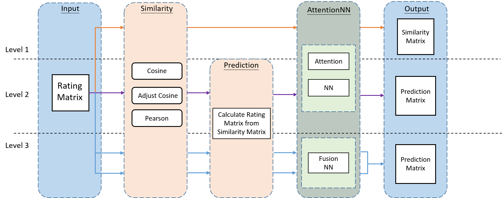
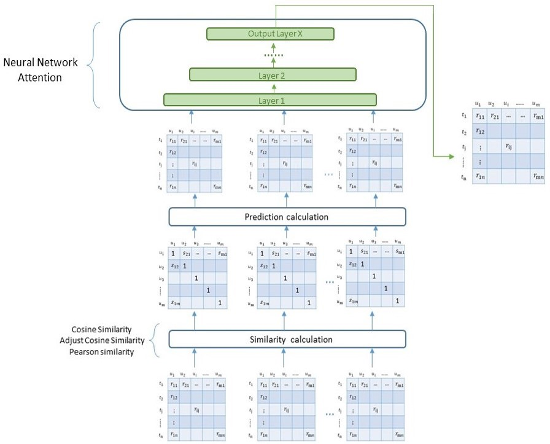
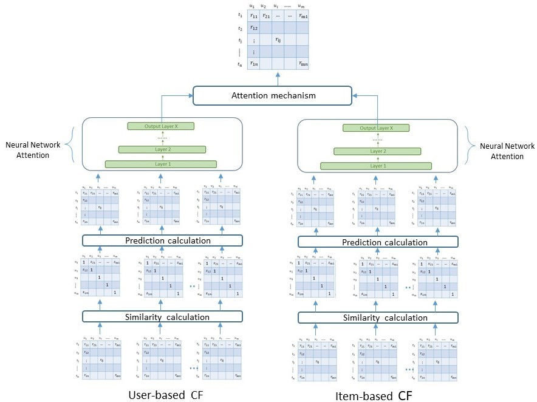

# ACCF model

## Model overview
{alt="Cover" width="50%"/}

### similarity level model
 
### prediction level model
 
### combine level model
 

### Description 

* 進行模型的訓練:
  * 包含 similarity level, prediction level, combine level
  * ACCF model 的參數實驗，包含: learning rate, epoch, batch size, unit, layers
* 實驗結果圖片繪製
* 評價指標: RMSE, MSE, MAE
* baseline 比較: UCF, itemKNN, SVD, ACF

### Tools 

* python
* numpy
* pandas
* scikit-learn
* tensorflow
