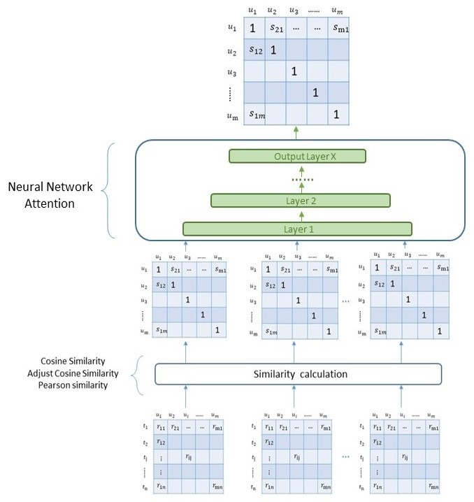

# ACCF model

## Model overview

### Level1: similarity level model

 
 
 1. 將rating matrix透過三種不同similarity的計算方式得到similarity matrix。
 2. 將similarity matrix分別input到neural network 與 attention mechanism中，得出所預測的下一個月的similarity matrix。
 3. 透過預測的similarity matrix計算prediction rating matrix，並與真實的rating matrix做比較 。

 
### prediction level model
 
 
1. 將rating matrix透過三種不同similarity的計算方式得到similarity matrix。
2. 透過similarity matrix計算得到prediction rating matrix。
3. 將prediction rating matrix分別input到neural network 與 attention mechanism中，得出所預測的下一個月的prediction rating matrix。
4. 將預測的prediction rating matrix 與真實的rating matrix 做比較。

### combine level model
 
 
1. 在基於prediction level下，將user-based CF 與 item-based CF 的模型透過attention mechanism結合，用以預測下一個月的prediction rating matrix。
2. 將 prediction rating matrix 與真實的rating matrix 做比較。

### Description 

* 進行模型的訓練:
  * 包含 similarity level, prediction level, combine level
  * ACCF model 的參數實驗，包含: learning rate, epoch, batch size, unit, layers
* 實驗結果圖片繪製
* 評價指標: RMSE, MSE, MAE
* baseline 比較: UCF, itemKNN, SVD, ACF

### Tools 

* python
* numpy
* pandas
* scikit-learn
* tensorflow
